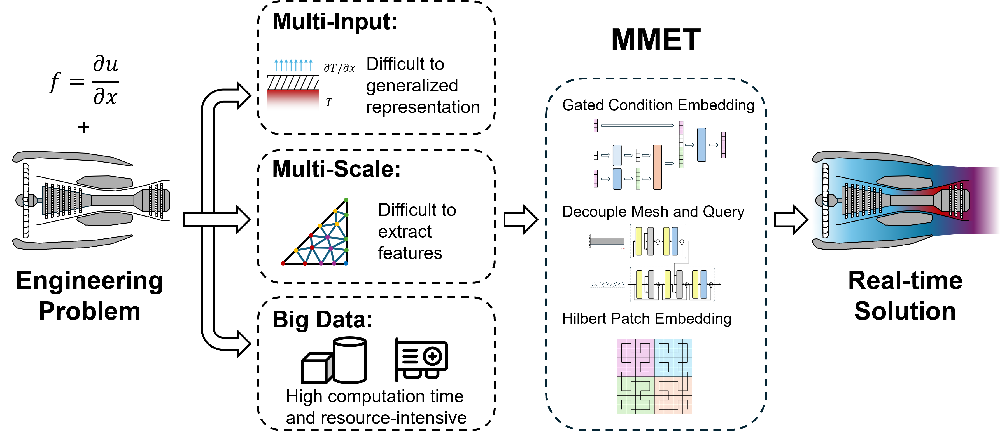
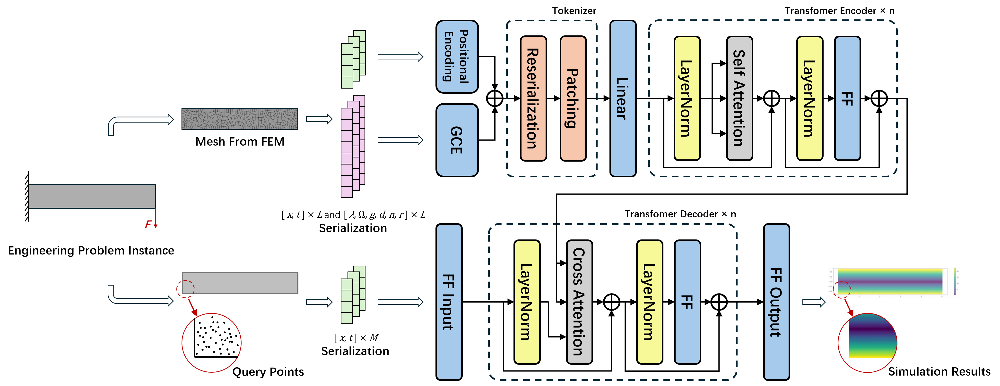

# MMET: Multi-Input and Multi-Scale Efficient Transformer

[](https://github.com/YichenLuo-0/MMET)
[](LICENSE)

Code for MMET: A Multi-Input and Multi-Scale Transformer for Efficient PDEs Solving, presented at *the 34th International Joint Conference on Artificial Intelligence (IJCAI 2025)*.

## Introduction

**MMET (Multi-Input and Multi-Scale Efficient Transformer)** is a Transformer-based framework tailored for solving partial differential equations (PDEs) in complex scientific and engineering domains. Traditional neural PDE solvers often struggle with generalization across varying geometries, boundary/initial conditions, and resolution scales. MMET addresses these limitations through a unified and scalable architecture.



Unlike existing methods that require model retraining for each new instance, MMET introduces a flexible encoder-decoder structure that separates mesh and query representations. This design enables:
- **Zero-shot generalization** across unseen geometries and boundary conditions,
- **Multi-scale querying** without retraining,
- And **reduced computational overhead** when handling large-scale unstructured meshes.

At the core of MMET are three key innovations:
- A **Gated Condition Embedding (GCE)** layer for dynamically encoding inputs with different types and dimensions;
- A **Hilbert-curve-based patch embedding** strategy to preserve spatial locality and reduce attention complexity;
- And a **multi-scale decoder** that directly supports adaptive resolution inference.

These components enable MMET to outperform state-of-the-art baselines across diverse physics benchmarks, including elasticity, fluid mechanics, thermodynamics, and porous media flow.




## Installation

```bash
git clone https://github.com/YichenLuo-0/MMET.git
cd MMET
pip install -r requirements.txt
```

Recommended environment:
- Python ≥ 3.8
- PyTorch ≥ 1.11
- GPU with ≥ 24GB memory for full-scale experiments

## Getting Started

### Train MMET on a PDE benchmark:

```bash
python train.py --config configs/heat2d.yaml
```

### Inference with pre-trained model:

```bash
python inference.py --model-checkpoint checkpoints/heat2d.pt --resolution 100x40
```

### Visualize predictions:

```bash
python plot_results.py --input data/test_case.pkl
```

## Datasets

Supported PDE benchmark datasets:

| Dataset        | Type                        | Highlights                                  |
|----------------|-----------------------------|---------------------------------------------|
| Poisson        | 2D physics-informed          | Classic PINN setup, analytical solution     |
| Shape-Net Car  | 3D aerodynamics              | Multi-scale meshes, complex geometry        |
| Darcy Flow     | 2D porous media              | PDEBench benchmark, variable diffusivity    |
| Heat2D         | 2D thermodynamics            | Multi-input, multi-geometry, dynamic BC     |
| Beam2D         | 2D solid mechanics           | Elasticity with dynamic boundary loads      |
| HeatSink2D     | Complex heat conduction      | No ground truth, physics-only supervision   |

More details and download links in [`docs/datasets.md`](docs/datasets.md).

## Citation

If you find this paper or repository helpful, please consider citing:

```bibtex
@inproceedings{luo2025mmet,
  title={MMET: A Multi-Input and Multi-Scale Transformer for Efficient PDEs Solving},
  author={Yichen Luo and Jia Wang and Dapeng Lan and Yu Liu and Zhibo Pang},
  booktitle={Proceedings of the 34th International Joint Conference on Artificial Intelligence (IJCAI)},
  year={2025}
}
```

## Contact

For questions or collaboration, feel free to contact:
- **Yichen Luo**: [yichenlu@kth.se](mailto:yichenlu@kth.se)
